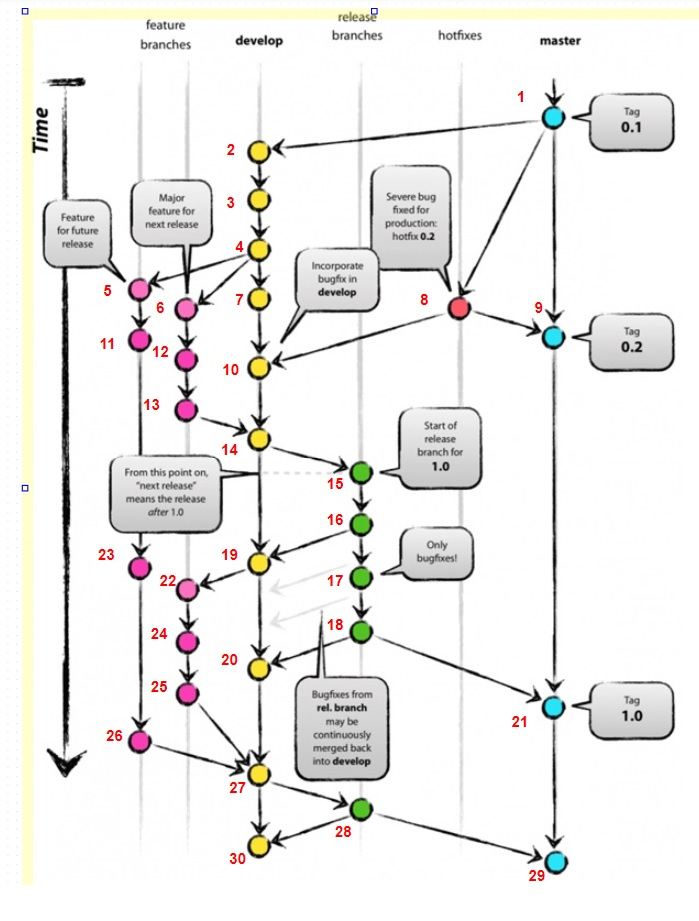

Задание: сделать историю, повторяющую следующую: 

   

Скриншот из idea веток (номера коммитов носят исключительно иллюстрационный характер, для сопоставления задания и решения, и не отображают последовательности выполнения коммитов):

   
   

